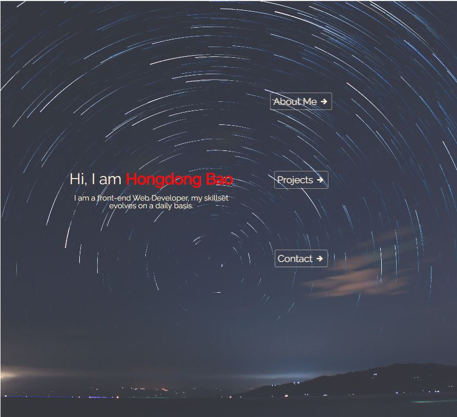
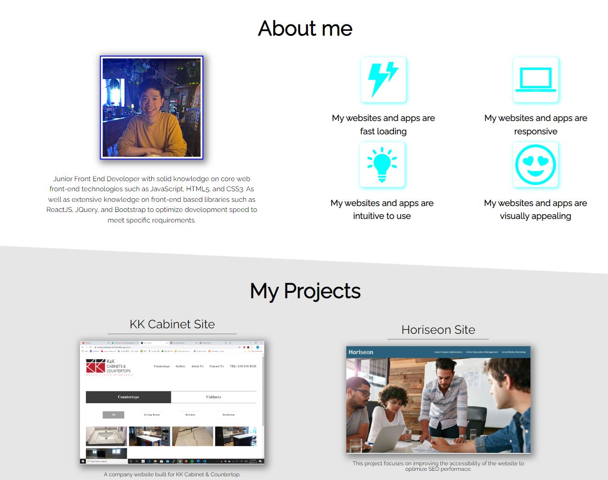

# Bootcamp-Module-2-Challenge

## About the project

This is Hongdong Bao's portfolio for employer references.

## Description

This is a developer's online portfolio developed with HTML and CSS. The webpage is made responsive and can support viewing on different screen sizes. Advanced CSS concepts such as Flexbox, CSS variables, animation, and media query are applied.

In the portfolio, you can find:

- Introduction on me as a developer, what skills do I possess.
- The highlights of my work.

* Links to my projects.
* My contact information.

## Visuals

Here are some screenshots of the portfolio site:

